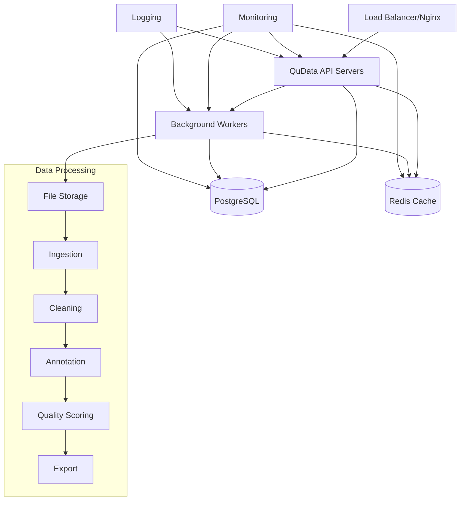

# QuData Deployment Guide

This document provides comprehensive deployment instructions for QuData LLM Processing System across different environments and deployment methods.

## Quick Start

### Docker Deployment (Recommended)

```bash
# Clone repository
git clone https://github.com/qubasehq/qudata.git
cd qudata

# Development deployment
docker-compose up -d

# Production deployment
cp .env.example .env
# Edit .env with your configuration
mkdir -p secrets
echo "your-secure-password" > secrets/db_password.txt
echo "your-redis-password" > secrets/redis_password.txt
openssl rand -base64 32 > secrets/secret_key.txt
chmod 600 secrets/*

docker-compose -f docker-compose.prod.yml up -d
```

### Manual Deployment

```bash
# System dependencies (Ubuntu/Debian)
sudo apt update && sudo apt install -y \
    python3 python3-pip python3-venv \
    postgresql redis-server nginx supervisor

# Application setup
git clone https://github.com/qubasehq/qudata.git
cd qudata
python3 -m venv venv
source venv/bin/activate
pip install -e ".[ml,web,dev]"

# Configure and start services
# See docs/deployment/manual-deployment.md for detailed instructions
```

## Deployment Options

### 1. Docker Deployment

**Best for**: Development, testing, and production environments requiring containerization.

**Advantages**:
- Consistent environment across different systems
- Easy scaling and orchestration
- Built-in monitoring and logging
- Simplified dependency management

**Files**:
- `Dockerfile` - Multi-stage production-ready image
- `docker-compose.yml` - Development environment
- `docker-compose.prod.yml` - Production environment with scaling

**Documentation**: [Docker Deployment Guide](docs/deployment/docker-deployment.md)

### 2. Manual Deployment

**Best for**: Environments requiring fine-grained control or where Docker is not available.

**Advantages**:
- Full control over system configuration
- Direct access to system resources
- Custom optimization possibilities
- Integration with existing infrastructure

**Documentation**: [Manual Deployment Guide](docs/deployment/manual-deployment.md)

### 3. Cloud Deployment

**Best for**: Scalable cloud-native deployments.

**Supported Platforms**:
- AWS (ECS, EKS, EC2)
- Google Cloud (GKE, Compute Engine)
- Azure (AKS, Container Instances)
- DigitalOcean (Kubernetes, Droplets)

**Documentation**: [Cloud Deployment Guide](docs/deployment/cloud-deployment.md)

## Architecture Overview



## Environment Configurations

### Development Environment

- **Purpose**: Local development and testing
- **Resources**: Minimal (2GB RAM, 2 CPU cores)
- **Features**: Hot reload, debug logging, development tools
- **Services**: API, Database, Cache, Optional monitoring

### Staging Environment

- **Purpose**: Pre-production testing and validation
- **Resources**: Medium (8GB RAM, 4 CPU cores)
- **Features**: Production-like configuration, comprehensive testing
- **Services**: All production services with reduced scaling

### Production Environment

- **Purpose**: Live production workloads
- **Resources**: High (16GB+ RAM, 8+ CPU cores)
- **Features**: High availability, monitoring, backup, security
- **Services**: Load-balanced API, workers, monitoring, logging

## Configuration Management

### Environment Variables

Key configuration through environment variables:

```bash
# Application
ENVIRONMENT=production
DEBUG=false
LOG_LEVEL=INFO

# Database
DB_HOST=postgres
DB_NAME=qudata
DB_USER=qudata
DB_PASSWORD=secure_password

# Performance
WORKERS=4
MAX_WORKERS=8
BATCH_SIZE=200
MAX_MEMORY=8GB

# Security
SECRET_KEY=your-secret-key
ALLOWED_HOSTS=your-domain.com
```

### Configuration Files

- `.env` - Environment-specific variables
- `configs/pipeline.yaml` - Processing pipeline configuration
- `configs/quality.yaml` - Quality scoring thresholds
- `configs/taxonomy.yaml` - Content classification rules

### Secrets Management

Production deployments use secure secret management:

```bash
# Docker Secrets
secrets/
├── db_password.txt
├── redis_password.txt
├── secret_key.txt
└── grafana_password.txt

# Kubernetes Secrets
kubectl create secret generic qudata-secrets \
  --from-file=db-password=secrets/db_password.txt \
  --from-file=redis-password=secrets/redis_password.txt
```

## Scaling and Performance

### Horizontal Scaling

Scale services based on load:

```bash
# Docker Compose
docker-compose -f docker-compose.prod.yml up -d --scale qudata-api=5 --scale qudata-worker=3

# Kubernetes
kubectl scale deployment qudata-api --replicas=5
kubectl scale deployment qudata-worker --replicas=3
```

### Performance Tuning

Key performance parameters:

```yaml
# API Server
WORKERS: 4                    # Number of API workers
MAX_WORKERS: 8               # Maximum workers
WORKER_TIMEOUT: 300          # Request timeout

# Processing
BATCH_SIZE: 200              # Documents per batch
MAX_MEMORY: 8GB              # Memory limit
PARALLEL_WORKERS: 4          # Parallel processing workers

# Database
DB_POOL_SIZE: 10             # Connection pool size
DB_MAX_OVERFLOW: 20          # Additional connections

# Cache
REDIS_MAX_CONNECTIONS: 50    # Redis connection pool
CACHE_TTL: 3600             # Cache expiration
```

### Resource Requirements

| Environment | CPU | RAM | Storage | Network |
|-------------|-----|-----|---------|---------|
| Development | 2 cores | 4GB | 20GB | 100Mbps |
| Staging | 4 cores | 8GB | 100GB | 1Gbps |
| Production | 8+ cores | 16GB+ | 500GB+ | 1Gbps+ |

## Monitoring and Observability

### Health Checks

Built-in health check endpoints:

```bash
# Application health
curl http://localhost:8000/health

# Component health
curl http://localhost:8000/health/db
curl http://localhost:8000/health/redis
curl http://localhost:8000/health/storage

# Detailed status
curl http://localhost:8000/status
```

### Metrics Collection

Prometheus metrics available at `/metrics`:

- Request/response metrics
- Processing performance
- Resource utilization
- Business metrics (documents processed, quality scores)

### Logging

Structured JSON logging with multiple levels:

```json
{
  "timestamp": "2024-01-15T10:30:00Z",
  "level": "INFO",
  "service": "qudata-api",
  "message": "Document processed successfully",
  "document_id": "uuid-here",
  "processing_time": 1.23,
  "quality_score": 0.85
}
```

### Dashboards

Pre-configured Grafana dashboards:

- System Overview
- API Performance
- Processing Metrics
- Quality Analytics
- Error Tracking

## Security

### Network Security

- TLS/SSL encryption for all external communication
- Network isolation between services
- Rate limiting and DDoS protection
- Firewall configuration

### Application Security

- Input validation and sanitization
- SQL injection prevention
- XSS protection
- CSRF protection
- Secure headers

### Data Security

- Encryption at rest and in transit
- PII detection and removal
- Access control and authentication
- Audit logging

### Container Security

- Non-root user execution
- Minimal base images
- Regular security updates
- Vulnerability scanning

## Backup and Recovery

### Automated Backups

```bash
# Database backup
docker-compose exec postgres pg_dump -U qudata qudata > backup.sql

# Data backup
tar -czf data_backup.tar.gz data/processed/

# Configuration backup
tar -czf config_backup.tar.gz configs/ .env
```

### Recovery Procedures

```bash
# Database restore
docker-compose exec -T postgres psql -U qudata -d qudata < backup.sql

# Data restore
tar -xzf data_backup.tar.gz

# Service restart
docker-compose restart
```

### Backup Schedule

- **Database**: Daily at 2 AM
- **Processed Data**: Weekly
- **Configuration**: On changes
- **Retention**: 30 days for database, 90 days for data

## Troubleshooting

### Common Issues

1. **Service won't start**
   - Check logs: `docker-compose logs service-name`
   - Verify configuration
   - Check resource availability

2. **Database connection issues**
   - Verify database is running
   - Check connection parameters
   - Test network connectivity

3. **Performance issues**
   - Monitor resource usage
   - Check for bottlenecks
   - Scale services if needed

4. **Memory issues**
   - Adjust batch sizes
   - Increase memory limits
   - Enable streaming processing

### Debug Mode

Enable debug logging:

```bash
export DEBUG=true
export LOG_LEVEL=DEBUG
docker-compose restart qudata
```

### Support Channels

- **Documentation**: [docs/](docs/)
- **GitHub Issues**: [Issues](https://github.com/qubasehq/qudata/issues)
- **Discussions**: [GitHub Discussions](https://github.com/qubasehq/qudata/discussions)

## Maintenance

### Updates

```bash
# Pull latest changes
git pull origin main

# Update dependencies
pip install -e ".[ml,web,dev]" --upgrade

# Restart services
docker-compose restart
```

### Health Monitoring

Regular health checks:

```bash
# System health
curl http://localhost:8000/health

# Performance metrics
curl http://localhost:8000/metrics

# Service status
docker-compose ps
```

### Log Rotation

Automatic log rotation configured:

- Application logs: 30 days retention
- System logs: 7 days retention
- Access logs: 90 days retention

## Production Checklist

Before deploying to production:

- [ ] SSL certificates configured
- [ ] Secrets properly secured
- [ ] Environment variables set
- [ ] Resource limits configured
- [ ] Monitoring enabled
- [ ] Backup procedures tested
- [ ] Security hardening applied
- [ ] Load testing completed
- [ ] Documentation updated
- [ ] Team training completed

## Getting Help

If you encounter issues during deployment:

1. Check the [troubleshooting section](#troubleshooting)
2. Review the relevant deployment guide
3. Search existing [GitHub issues](https://github.com/qubasehq/qudata/issues)
4. Create a new issue with deployment details
5. Join the [community discussions](https://github.com/qubasehq/qudata/discussions)

## Contributing

To contribute to deployment documentation:

1. Fork the repository
2. Create a feature branch
3. Make your changes
4. Test the deployment process
5. Submit a pull request

For more information, see [CONTRIBUTING.md](CONTRIBUTING.md).