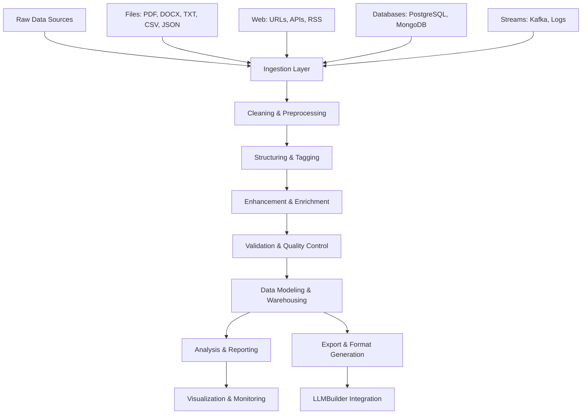

# QuD△ta

**A comprehensive LLM data processing system designed to transform raw multi-format data into high-quality training datasets optimized for Large Language Models.**

[](https://www.python.org/downloads/)
[](https://opensource.org/licenses/MIT)
[](https://github.com/psf/black)

QuD△ta focuses on tool usage, knowledge recall, and instruction-following capabilities while maintaining privacy through offline processing and supporting both CPU-only and GPU-accelerated environments.

## 🚀 Complete Beginner's Guide

### What is QuD△ta?

QuD△ta is like a smart assistant that takes messy documents (PDFs, Word files, web pages, etc.) and turns them into clean, organized data that AI models can learn from. Think of it as a document processing factory that:

- **Reads** documents in many formats (PDF, Word, HTML, text files, etc.)
- **Cleans** the text (removes junk, fixes errors, removes duplicates)
- **Organizes** the content (adds categories, extracts important information)
- **Exports** everything in formats that AI training systems can use

### Installation (Step by Step)

**Step 1: Make sure you have Python**
```bash
# Check if Python is installed (you need version 3.8 or newer)
python --version

# If you don't have Python, download it from python.org
```

**Step 2: Download QuData**
```bash
# Download the QuData project
git clone https://github.com/qubasehq/qudata.git
cd qudata

# Install QuData (this might take a few minutes)
pip install -e .

# Check if it worked
qudata --version
```

**Step 3: Install extra features (optional)**
```bash
# For advanced AI features (recommended)
pip install -e ".[ml]"

# For web scraping (if you want to process websites)
pip install -e ".[web]"

# For developers (if you want to modify QuData)
pip install -e ".[dev]"
```

### Your First Document Processing (5 Minutes)

**Step 1: Initialize your project (recommended)**
```bash
# Create the standard QuData project structure in the current directory
qudata init

# Or specify a target directory
qudata init --path my-qudata-project

# Put your documents in data/raw/
# You can use PDFs, Word documents, text files, HTML files, etc.
```

Alternatively, set up folders manually:
```bash
mkdir -p data/raw data/processed
mkdir -p exports/jsonl exports/chatml exports/llmbuilder exports/plain
mkdir -p configs
```

**Step 2: Process your documents**
```bash
# This command processes all files in data/raw and cleans them
qudata process --input data/raw --output data/processed

# You'll see progress messages like:
# ✓ Processing document1.pdf...
# ✓ Processing document2.docx...
# ✓ Processed 5 documents successfully
```

**Step 3: Export for AI training**
```bash
# Convert processed documents to AI training format
qudata export --format jsonl --input data/processed --output exports/jsonl/training.jsonl

# This creates a file that AI systems can use for training
```

**That's it!** You've just processed your first documents with QuData.

### Understanding What Happened

When you ran those commands, QuData did several things automatically:

1. **File Detection**: Figured out what type each file was (PDF, Word, etc.)
2. **Text Extraction**: Pulled out all the readable text from your documents
3. **Cleaning**: Removed junk like headers, footers, and duplicate content
4. **Quality Check**: Made sure the text was good enough for AI training
5. **Organization**: Added categories and metadata to help organize the content
6. **Export**: Saved everything in a format that AI systems can understand

### Simple Command Examples

**Process different types of files:**
```bash
# Process only PDF files
qudata process --input data/raw --output data/processed --format pdf

# Process only Word documents
qudata process --input data/raw --output data/processed --format docx

# Process web pages (HTML files)
qudata process --input data/raw --output data/processed --format html
```

**Export in different formats:**
```bash
# Export as JSONL (most common for AI training)
qudata export --format jsonl --input data/processed --output training.jsonl

# Export as CSV (good for spreadsheets)
qudata export --format csv --input data/processed --output training.csv

# Export as Parquet (good for big data analysis)
qudata export --format parquet --input data/processed --output training.parquet
```

**Split data for AI training:**
```bash
# Split into training, validation, and test sets (80%, 10%, 10%)
qudata export --format jsonl --input data/processed --output exports/jsonl --split

# This creates three files under exports/jsonl/:
# - train.jsonl (80% of your data)
# - validation.jsonl (10% of your data)
# - test.jsonl (10% of your data)
```

**Check the quality of your data:**
```bash
# Analyze your processed documents
qudata analyze --input data/processed --output analysis.json

# Get detailed analysis with topics and sentiment
qudata analyze --input data/processed --output analysis.json --include-topics --include-sentiment
```

### Python Examples (Copy and Paste Ready)

**Example 1: Process a single file**
```python
from qudata import QuDataPipeline

# Create a pipeline
pipeline = QuDataPipeline()

# Process one file
result = pipeline.process_file("my_document.pdf")

if result.success:
    print(f"Success! Quality score: {result.document.quality_score}")
    print(f"Language detected: {result.document.metadata.language}")
    print(f"Content length: {len(result.document.content)} characters")
else:
    print("Processing failed:")
    for error in result.errors:
        print(f"  - {error.message}")
```

**Example 2: Process multiple files**
```python
from qudata import QuDataPipeline

# Create a pipeline
pipeline = QuDataPipeline()

# Process all files in a folder
results = pipeline.process_directory("data/raw", "data/processed")

print(f"Processed {len(results.successful)} documents successfully")
print(f"Failed to process {len(results.failed)} documents")

# Show average quality
if results.successful:
    avg_quality = sum(r.document.quality_score for r in results.successful) / len(results.successful)
    print(f"Average quality score: {avg_quality:.2f}")
```

**Example 3: Export processed data**
```python
from qudata import QuDataPipeline

# Create a pipeline and process documents
pipeline = QuDataPipeline()
results = pipeline.process_directory("data/raw", "data/processed")

# Get the successful documents
successful_docs = [r.document for r in results.successful]

# Export to different formats
jsonl_path = pipeline.export_dataset(successful_docs, format="jsonl", output="training.jsonl")
csv_path = pipeline.export_dataset(successful_docs, format="csv", output="training.csv")

print(f"Exported to JSONL: {jsonl_path}")
print(f"Exported to CSV: {csv_path}")
```

**Example 4: Process with custom settings**
```python
from qudata import QuDataPipeline, load_config

# Load custom configuration
config = load_config("configs/my_settings.yaml")

# Create pipeline with custom settings
pipeline = QuDataPipeline(config)

# Process documents
results = pipeline.process_directory("data/raw", "data/processed")

print(f"Processed {len(results.successful)} documents with custom settings")
```

### Real-World Use Cases

**Use Case 1: Academic Research Papers**
```bash
# Put your PDF research papers in data/raw/
# Use academic paper configuration
qudata process --input data/raw --output data/processed --config configs/templates/academic-papers.yaml

# Export for AI training on academic content
qudata export --format jsonl --input data/processed --output academic_training.jsonl --split
```

**Use Case 2: Company Documents**
```bash
# Process company reports, manuals, policies
qudata process --input company_docs/ --output processed_docs/ --config configs/templates/enterprise-pipeline.yaml

# Export for internal AI assistant training
qudata export --format chatml --input processed_docs/ --output company_ai_data.jsonl
```

**Use Case 3: Web Content**
```bash
# Process downloaded web articles and blog posts
qudata process --input web_content/ --output clean_content/ --config configs/templates/web-content.yaml

# Export for content analysis
qudata export --format parquet --input clean_content/ --output web_analysis.parquet
```

**Use Case 4: Code Documentation**
```bash
# Process programming documentation and tutorials
qudata process --input code_docs/ --output processed_docs/ --config configs/templates/code-documentation.yaml

# Export for coding AI assistant
qudata export --format jsonl --input processed_docs/ --output coding_training.jsonl
```

### Web Interface (Easy Mode)

If you prefer clicking buttons instead of typing commands:

```bash
# Start the web interface
qudata server --host 0.0.0.0 --port 8000

# Open your web browser and go to:
# http://localhost:8000

# You'll see a web interface where you can:
# - Upload files by dragging and dropping
# - Configure processing settings with forms
# - Monitor progress with progress bars
# - Download results with one click
```

### Configuration Made Simple

QuData uses configuration files to control how it processes your documents. Think of these as "recipes" that tell QuData exactly what to do.

**Basic configuration (configs/simple.yaml):**
```yaml
# This is a simple configuration file
pipeline:
  input_directory: "data/raw"      # Where your documents are
  output_directory: "data/processed"  # Where cleaned documents go

# What types of files to process
ingest:
  file_types: ["pdf", "docx", "txt", "html"]
  max_file_size: "100MB"

# How to clean the text
clean:
  remove_duplicates: true    # Remove duplicate content
  normalize_text: true       # Fix formatting issues
  min_quality_score: 0.6     # Only keep good quality text

# What formats to export
export:
  formats: ["jsonl"]         # Export as JSONL for AI training
  split_data: true          # Split into train/validation/test
```

**Use your configuration:**
```bash
qudata process --config configs/simple.yaml
```

### Monitoring and Quality Control

**Check processing progress:**
```bash
# See detailed progress information
qudata process --input data/raw --output data/processed --verbose

# See statistics about your processing
qudata process --input data/raw --output data/processed --stats
```

**Quality analysis:**
```bash
# Get a quality report
qudata analyze --input data/processed --output quality_report.json

# The report will tell you:
# - How many documents were processed
# - Average quality scores
# - Language distribution
# - Content statistics
# - Potential issues
```

**View results in a dashboard:**
```bash
# Start the dashboard
qudata dashboard --input data/processed --port 8501

# Open http://localhost:8501 to see:
# - Interactive charts and graphs
# - Quality score distributions
# - Content analysis
# - Processing statistics
```

### Troubleshooting Common Issues

**Problem: "Out of memory" error**
```yaml
# Solution: Use smaller batches in your config
pipeline:
  batch_size: 50           # Process fewer files at once
  streaming_mode: true     # Use less memory
  max_memory_usage: "2GB"  # Limit memory usage
```

**Problem: Processing is too slow**
```yaml
# Solution: Enable parallel processing
pipeline:
  parallel_processing: true
  max_workers: 4           # Use 4 CPU cores (adjust for your computer)
```

**Problem: Quality scores are too low**
```yaml
# Solution: Lower the quality threshold
quality:
  min_score: 0.4           # Accept lower quality documents
  auto_filter: false       # Don't automatically remove low quality
```

**Problem: Files are not being processed**
```bash
# Check what file types are supported
qudata info --supported-formats

# Enable verbose logging to see what's happening
qudata process --input data/raw --output data/processed --verbose --log-level DEBUG
```

### Advanced Features (When You're Ready)

**Web scraping:**
```python
from qudata.ingest import WebScraper

# Scrape content from websites
scraper = WebScraper()
content = scraper.scrape_url("https://example.com/article")

# Process scraped content
pipeline = QuDataPipeline()
result = pipeline.process_content(content)
```

**Database integration:**
```python
from qudata.database import DatabaseConnector

# Connect to a database
connector = DatabaseConnector()
connection = connector.connect({
    "type": "postgresql",
    "host": "localhost",
    "database": "my_database",
    "username": "user",
    "password": "password"
})

# Extract data from database
documents = connector.extract_documents("SELECT title, content FROM articles")

# Process database content
pipeline = QuDataPipeline()
results = pipeline.process_documents(documents)
```

**API integration:**
```python
from qudata.api import RESTAPIServer

# Start API server for integration with other systems
server = RESTAPIServer()
server.start(host="0.0.0.0", port=8000)

# Other systems can now send documents to:
# POST http://localhost:8000/process
```

### Getting Help

**Built-in help:**
```bash
# Get help for any command
qudata --help
qudata process --help
qudata export --help
```

**Check system status:**
```bash
# See if everything is working
qudata status

# Test with sample data
qudata test --sample-data
```

**Logging and debugging:**
```bash
# Enable detailed logging
qudata process --input data/raw --output data/processed --log-level DEBUG --log-file processing.log

# Check the log file for detailed information
cat processing.log
```

### Next Steps

Once you're comfortable with the basics:

1. **Explore Examples**: Look at the `examples/` folder for more complex use cases
2. **Custom Configuration**: Create your own configuration files for specific needs
3. **Integration**: Connect QuData to your existing systems using the API
4. **Scaling**: Learn about distributed processing for large datasets
5. **Contributing**: Help improve QuData by reporting issues or contributing code

### Quick Reference Card

**Essential Commands:**
```bash
# Initialize a project
qudata init --path my-qudata-project

# Process documents
qudata process --input data/raw --output data/processed

# Export for AI training
qudata export --format jsonl --input data/processed --output exports/jsonl --split

# Analyze quality
qudata analyze --input data/processed --output analysis.json

# Start web interface
qudata server --port 8000

# Get help
qudata --help
```

**Essential Python:**
```python
from qudata import QuDataPipeline

# Basic processing
pipeline = QuDataPipeline()
results = pipeline.process_directory("data/raw", "data/processed")

# Export results
successful_docs = [r.document for r in results.successful]
pipeline.export_dataset(successful_docs, format="jsonl", output="training.jsonl")
```

This guide should get you started with QuData, whether you're a complete beginner or an experienced developer. The system is designed to be powerful yet easy to use, with sensible defaults that work well for most use cases.

## 🏗️ Architecture

QuData follows a modular pipeline architecture with distinct processing stages:



## 📁 Project Structure

```
QuData/
├── configs/                    # Configuration files
│   ├── pipeline.yaml          # Main pipeline configuration
│   ├── taxonomy.yaml          # Domain classification rules
│   ├── cleansing_rules.yaml   # Text cleaning rules
│   ├── quality.yaml           # Quality scoring thresholds
│   ├── labels.yaml            # Label schemas
│   └── templates/             # Configuration templates
├── src/qudata/                 # Main package
│   ├── ingest/               # Multi-format data ingestion
│   │   ├── detector.py       # File type detection
│   │   ├── pdf.py           # PDF extraction
│   │   ├── document.py      # DOCX, ODT processing
│   │   ├── web.py           # HTML, web scraping
│   │   ├── structured.py    # CSV, JSON, XML
│   │   ├── api.py           # REST/GraphQL APIs
│   │   ├── scraper.py       # Web scraping
│   │   ├── stream.py        # RSS, Kafka, logs
│   │   └── ocr.py           # OCR processing
│   ├── clean/                # Text cleaning & normalization
│   │   ├── normalize.py     # Unicode normalization
│   │   ├── dedupe.py        # Deduplication
│   │   ├── boilerplate.py   # Boilerplate removal
│   │   ├── language.py      # Language detection
│   │   ├── sanitize.py      # PII sanitization
│   │   ├── html_cleaner.py  # HTML cleaning
│   │   ├── segment.py       # Text segmentation
│   │   └── pipeline.py      # Cleaning orchestration
│   ├── annotate/             # Content annotation & tagging
│   │   ├── taxonomy.py      # Domain classification
│   │   ├── metadata.py      # Metadata extraction
│   │   ├── ner.py           # Named entity recognition
│   │   └── catalog.py       # Content cataloging
│   ├── score/                # Quality assessment
│   │   └── quality.py       # Multi-dimensional scoring
│   ├── export/               # Content structuring & export
│   │   ├── segmenter.py     # Training format segmentation
│   │   ├── formats.py       # Export format handlers
│   │   └── llmbuilder.py    # LLMBuilder integration
│   ├── pack/                 # Dataset packaging
│   │   ├── plain.py         # Plain text format
│   │   ├── jsonl.py         # JSONL format
│   │   └── chatml.py        # ChatML format
│   ├── analyze/              # Data analysis & reporting
│   │   ├── analysis_engine.py # Main analysis engine
│   │   ├── text_analyzer.py   # Text statistics
│   │   ├── topic_modeler.py   # Topic modeling
│   │   ├── sentiment_analyzer.py # Sentiment analysis
│   │   ├── language_analyzer.py  # Language analysis
│   │   └── quality_analyzer.py   # Quality analysis
│   ├── visualize/            # Visualization & monitoring
│   │   ├── dashboard.py     # Interactive dashboards
│   │   ├── charts.py        # Chart generation
│   │   ├── metrics.py       # Metrics collection
│   │   ├── reports.py       # Report generation
│   │   └── alerts.py        # Alert management
│   ├── database/             # Data storage & warehousing
│   │   ├── connector.py     # Database connections
│   │   ├── sql_extractor.py # SQL database extraction
│   │   ├── nosql_extractor.py # NoSQL extraction
│   │   ├── schema_manager.py  # Schema management
│   │   ├── versioning.py    # Data versioning
│   │   ├── incremental.py   # Incremental processing
│   │   ├── partitioning.py  # Data partitioning
│   │   └── backup.py        # Backup management
│   ├── orchestrate/          # Workflow orchestration
│   │   ├── orchestrator.py  # Main orchestrator
│   │   ├── scheduler.py     # Task scheduling
│   │   ├── runner.py        # Pipeline execution
│   │   ├── dependencies.py  # Dependency management
│   │   └── retry.py         # Retry logic
│   ├── api/                  # API interfaces
│   │   ├── rest_server.py   # REST API server
│   │   ├── graphql_endpoint.py # GraphQL endpoint
│   │   ├── webhook_manager.py  # Webhook management
│   │   └── sdk_generator.py    # SDK generation
│   ├── performance/          # Performance optimization
│   │   ├── parallel.py      # Parallel processing
│   │   ├── memory.py        # Memory management
│   │   ├── cache.py         # Caching layer
│   │   ├── streaming.py     # Streaming processing
│   │   └── load_balancer.py # Load balancing
│   ├── validation/           # Testing & validation
│   │   ├── dataset_validator.py    # Dataset validation
│   │   ├── quality_benchmarks.py  # Quality benchmarks
│   │   ├── performance_profiler.py # Performance profiling
│   │   ├── integration_tester.py   # Integration testing
│   │   └── sample_data_generator.py # Test data generation
│   ├── utils/                # Common utilities
│   │   ├── text.py          # Text utilities
│   │   ├── html.py          # HTML utilities
│   │   └── io.py            # I/O utilities
│   ├── config.py             # Configuration management
│   ├── models.py             # Data models
│   ├── pipeline.py           # Main pipeline
│   └── cli.py                # Command-line interface
├── data/                     # Data directories
│   ├── raw/                  # Input data
│   ├── staging/              # Intermediate files
│   └── processed/            # Cleaned data
├── exports/                  # Final datasets (by format)
│   ├── jsonl/
│   ├── chatml/
│   ├── llmbuilder/
│   └── plain/
├── docs/                     # Documentation
│   ├── user-guide/           # User guides
│   ├── api/                  # API documentation
│   └── deployment/           # Deployment guides
├── examples/                 # Usage examples
├── tests/                    # Test suites
│   ├── unit/                 # Unit tests
│   ├── integration/          # Integration tests
│   └── benchmarks/           # Performance benchmarks
└── configs/                  # Configuration templates
```

## 🔧 Core Features

### 📥 Multi-Format Data Ingestion

**Supported Formats:**
- **Documents**: PDF, DOCX, ODT, RTF, TXT, MD
- **Web Content**: HTML, XML, RSS feeds
- **Structured Data**: CSV, JSON, JSONL, XML
- **Images**: OCR processing for scanned documents
- **Databases**: PostgreSQL, MySQL, MongoDB, Elasticsearch
- **APIs**: REST, GraphQL endpoints
- **Streams**: Kafka, log files, real-time feeds

**Key Capabilities:**
- Automatic file type detection
- Metadata extraction (author, date, source)
- Table and image extraction from documents
- Web scraping with rate limiting
- Database query optimization
- Streaming data processing

### 🧹 Advanced Text Cleaning & Preprocessing

**Cleaning Features:**
- Unicode normalization and encoding detection
- Boilerplate removal (headers, footers, navigation)
- Duplicate detection and removal
- Language detection and filtering
- OCR error correction
- PII detection and sanitization
- HTML tag and emoji removal
- Sentence segmentation and normalization

**Quality Control:**
- Multi-dimensional quality scoring
- Configurable quality thresholds
- Content validation and filtering
- Format compliance checking

### 🏷️ Intelligent Content Annotation

**Annotation Capabilities:**
- Domain and topic classification
- Named Entity Recognition (NER)
- Metadata extraction and enrichment
- Cross-document relationship detection
- Keyword and phrase extraction
- Content categorization with custom taxonomies

### 📊 Comprehensive Data Analysis

**Analysis Features:**
- Text statistics and token analysis
- Topic modeling (LDA, BERTopic)
- Sentiment analysis and polarity scoring
- Language distribution analysis
- Quality metrics and scoring
- Performance benchmarking

### 📈 Visualization & Monitoring

**Dashboard Features:**
- Interactive Streamlit/Dash dashboards
- Real-time processing metrics
- Quality score distributions
- Topic visualization and clustering
- Language and domain analytics
- Alert management and notifications

### 🗄️ Data Warehousing & Storage

**Storage Options:**
- File-based storage (Parquet, JSON)
- SQL databases (PostgreSQL, MySQL)
- NoSQL databases (MongoDB, Elasticsearch)
- Data versioning and snapshots
- Incremental processing support
- Backup and recovery mechanisms

### 🚀 Export & Format Generation

**Export Formats:**
- **JSONL**: General LLM training format
- **ChatML**: Conversational model training
- **Alpaca**: Instruction-following format
- **Parquet**: Analytics and large-scale processing
- **CSV**: Tabular data export
- **Custom**: Extensible format system

**Dataset Features:**
- Train/validation/test splits
- Stratified sampling by quality/domain
- Format validation and compliance
- Metadata preservation

### 🔗 LLMBuilder Integration

**Integration Features:**
- Automatic dataset export to LLMBuilder
- Training pipeline triggering
- Model performance correlation tracking
- Multi-version dataset management
- API-based integration

### 🌐 API & Web Interfaces

**REST API:**
- Full CRUD operations for datasets
- Asynchronous processing jobs
- Webhook support for events
- Rate limiting and authentication
- Comprehensive API documentation

**GraphQL Endpoint:**
- Flexible data querying
- Real-time subscriptions
- Schema introspection
- Custom resolvers

**Web Dashboard:**
- Processing status monitoring
- Quality metrics visualization
- Configuration management
- Dataset exploration

### ⚡ Performance & Scalability

**Optimization Features:**
- Multi-threaded parallel processing
- Streaming processing for large files
- Memory-efficient batch processing
- Caching layer for expensive operations
- Load balancing for distributed processing
- GPU acceleration support (optional)

## 🛠️ Configuration

QuData uses YAML configuration files for customization:

### Pipeline Configuration (`configs/pipeline.yaml`)

```yaml
pipeline:
  name: "my_pipeline"
  version: "1.0.0"
  
  # Processing paths
  paths:
    raw_data: "data/raw"
    staging: "data/staging"
    processed: "data/processed"
    exports: "data/exports"
  
  # Performance settings
  performance:
    parallel_processing: true
    max_workers: 4
    batch_size: 100
    streaming_mode: true
    max_memory_usage: "4GB"
  
  # Processing stages
  stages:
    ingest:
      enabled: true
      file_types: ["pdf", "docx", "txt", "html", "csv", "json"]
      max_file_size: "100MB"
      extract_metadata: true
      ocr_enabled: true
      
    clean:
      enabled: true
      normalize_unicode: true
      remove_boilerplate: true
      deduplicate: true
      similarity_threshold: 0.85
      language_filter: ["en", "es", "fr"]
      min_quality_score: 0.6
      
    annotate:
      enabled: true
      taxonomy_classification: true
      named_entity_recognition: true
      topic_modeling: true
      cross_reference: true
      
    score:
      enabled: true
      dimensions:
        content: 0.4
        language: 0.3
        structure: 0.3
      min_score: 0.7
      
    export:
      enabled: true
      formats: ["jsonl", "chatml", "parquet"]
      split_data: true
      split_ratios:
        train: 0.8
        validation: 0.1
        test: 0.1
```

### Quality Configuration (`configs/quality.yaml`)

```yaml
quality:
  version: "1.0"
  
  # Quality thresholds
  thresholds:
    min_length: 50
    max_length: 10000
    min_language_confidence: 0.8
    min_coherence_score: 0.6
    max_duplicate_similarity: 0.9
  
  # Scoring weights
  scoring_weights:
    length: 0.2
    language: 0.2
    coherence: 0.3
    uniqueness: 0.3
  
  # Auto-filtering
  auto_filter: true
  filter_threshold: 0.5
```

### Taxonomy Configuration (`configs/taxonomy.yaml`)

```yaml
taxonomy:
  version: "1.0"
  
  # Domain categories
  domains:
    technology:
      - programming
      - artificial_intelligence
      - machine_learning
      - software_engineering
    science:
      - physics
      - chemistry
      - biology
      - mathematics
    business:
      - finance
      - marketing
      - management
      - economics
    general:
      - news
      - entertainment
      - lifestyle
      - education
  
  # Classification rules
  classification_rules:
    - domain: "technology"
      keywords: ["python", "javascript", "programming", "software", "AI", "ML"]
      weight: 1.0
    - domain: "science"
      keywords: ["research", "study", "experiment", "hypothesis", "theory"]
      weight: 0.8
```

## 📚 Usage Examples

### Basic Document Processing

```python
from qudata import QuDataPipeline, load_config

# Load configuration
config = load_config("configs/pipeline.yaml")

# Initialize pipeline
pipeline = QuDataPipeline(config)

# Process single file
result = pipeline.process_file("document.pdf")
if result.success:
    print(f"Quality score: {result.document.quality_score}")
    print(f"Language: {result.document.metadata.language}")
    print(f"Topics: {result.document.metadata.topics}")

# Process directory
results = pipeline.process_directory("data/raw", "data/processed")
print(f"Processed {len(results.successful)} documents")
```

### Web Scraping and API Integration

```python
from qudata.ingest import WebScraper, APIClient

# Web scraping
scraper = WebScraper(rate_limit=60)  # 60 requests per minute
content = scraper.scrape_url("https://example.com/article")

# API integration
api_client = APIClient()
data = api_client.fetch_data(
    endpoint="https://api.example.com/articles",
    params={"category": "technology", "limit": 100}
)

# Process scraped content
pipeline = QuDataPipeline()
results = pipeline.process_content([content, data])
```

### Database Integration

```python
from qudata.database import DatabaseConnector, SQLExtractor

# Connect to database
connector = DatabaseConnector()
connection = connector.connect({
    "type": "postgresql",
    "host": "localhost",
    "database": "content_db",
    "username": "user",
    "password": "password"
})

# Extract data
extractor = SQLExtractor(connection)
documents = extractor.extract_documents(
    query="SELECT title, content, created_at FROM articles WHERE quality_score > 0.7"
)

# Process extracted data
pipeline = QuDataPipeline()
results = pipeline.process_documents(documents)
```

### Advanced Analysis and Visualization

```python
from qudata.analyze import AnalysisEngine
from qudata.visualize import DashboardServer

# Comprehensive analysis
analyzer = AnalysisEngine()
analysis_result = analyzer.analyze_dataset(
    dataset_path="data/processed",
    include_topics=True,
    include_sentiment=True,
    include_entities=True
)

print(f"Total documents: {analysis_result.statistics.total_documents}")
print(f"Average quality: {analysis_result.statistics.avg_quality_score}")
print(f"Top topics: {analysis_result.topics[:5]}")

# Start dashboard
dashboard = DashboardServer()
dashboard.add_analysis_data(analysis_result)
dashboard.run(host="0.0.0.0", port=8501)
```

### Custom Processing Pipeline

```python
from qudata import QuDataPipeline
from qudata.clean import CustomCleaner
from qudata.annotate import CustomAnnotator

# Define custom components
class MyCustomCleaner(CustomCleaner):
    def clean_text(self, text: str) -> str:
        # Custom cleaning logic
        return text.strip().lower()

class MyCustomAnnotator(CustomAnnotator):
    def annotate_document(self, document):
        # Custom annotation logic
        document.metadata.custom_field = "custom_value"
        return document

# Create pipeline with custom components
pipeline = QuDataPipeline()
pipeline.add_cleaner(MyCustomCleaner())
pipeline.add_annotator(MyCustomAnnotator())

# Process with custom pipeline
results = pipeline.process_directory("data/raw")
```

### Streaming Data Processing

```python
from qudata.ingest import StreamProcessor
from qudata.performance import StreamingProcessor

# Set up streaming processor
stream_processor = StreamProcessor()

# Process RSS feeds
rss_stream = stream_processor.create_rss_stream([
    "https://feeds.example.com/tech.xml",
    "https://feeds.example.com/science.xml"
])

# Process Kafka stream
kafka_stream = stream_processor.create_kafka_stream(
    topic="content_stream",
    bootstrap_servers=["localhost:9092"]
)

# Process streams with pipeline
streaming_pipeline = StreamingProcessor(batch_size=50)
for batch in rss_stream.process():
    results = streaming_pipeline.process_batch(batch)
    print(f"Processed batch of {len(results)} documents")
```

## 🚀 Command Line Interface

QuData provides a comprehensive CLI for all operations:

### Processing Commands

```bash
# Basic processing
qudata process --input data/raw --output data/processed

# With custom configuration
qudata process --input data/raw --output data/processed --config configs/my_config.yaml

# Parallel processing
qudata process --input data/raw --output data/processed --parallel 8 --verbose

# Format-specific processing
qudata process --input data/raw --output data/processed --format jsonl
```

### Export Commands

```bash
# Export to JSONL
qudata export --format jsonl --input data/processed --output training.jsonl

# Export with splits
qudata export --format jsonl --input data/processed --output data/exports --split

# Multiple format export
qudata export --format chatml --input data/processed --output chat_training.jsonl
qudata export --format parquet --input data/processed --output analytics.parquet
```

### Analysis Commands

```bash
# Basic analysis
qudata analyze --input data/processed --output analysis.json

# Comprehensive analysis
qudata analyze --input data/processed --output analysis.json --include-topics --include-sentiment

# Different output formats
qudata analyze --input data/processed --output analysis.yaml --format yaml
qudata analyze --input data/processed --output analysis.csv --format csv
```

### Server Commands

```bash
# Start basic API server
qudata server --host 0.0.0.0 --port 8000

# Start with all features
qudata server --host 0.0.0.0 --port 8000 --graphql --webhooks --reload

# Start with custom configuration
qudata server --config configs/api_config.yaml --port 8000
```

### Dataset Management

```bash
# List datasets
qudata dataset list --format table

# Validate dataset
qudata dataset validate --input data/processed --schema configs/dataset_schema.yaml

# Show dataset information
qudata dataset info --id dataset_123
```

### Configuration Management

```bash
# Show current configuration
qudata config show --file configs/pipeline.yaml

# Validate configuration
qudata config validate --file configs/my_config.yaml

# Generate configuration template
qudata config template --output my_pipeline.yaml --type pipeline
```

### Webhook Management

```bash
# Add webhook endpoint
qudata webhook add --url https://example.com/webhook --events processing.completed job.failed

# List webhook endpoints
qudata webhook list --format table

# Test webhook endpoint
qudata webhook test --id webhook_123

# Remove webhook endpoint
qudata webhook remove --id webhook_123
```

## 🧪 Development & Testing

### Development Setup

```bash
# Clone repository
git clone https://github.com/qubasehq/qudata.git
cd qudata

# Install in development mode
pip install -e ".[dev,ml,web]"

# Install pre-commit hooks
pre-commit install

# Run tests
pytest tests/ -v

# Run specific test categories
pytest tests/unit/ -v                    # Unit tests
pytest tests/integration/ -v             # Integration tests
pytest tests/benchmarks/ -v              # Performance benchmarks
```

### Code Quality

```bash
# Format code
black src/ tests/

# Check code style
flake8 src/ tests/

# Type checking
mypy src/

# Run all quality checks
pre-commit run --all-files
```

### Testing

```bash
# Run all tests
pytest

# Run with coverage
pytest --cov=src/qudata --cov-report=html

# Run performance benchmarks
pytest tests/benchmarks/ --benchmark-only

# Run integration tests
pytest tests/integration/ -v --slow
```

### Creating Custom Components

```python
# Custom extractor
from qudata.ingest import BaseExtractor

class MyCustomExtractor(BaseExtractor):
    def supports_format(self, file_type: str) -> bool:
        return file_type == "custom"
    
    def extract(self, file_path: str) -> ExtractedContent:
        # Implementation here
        pass

# Custom cleaner
from qudata.clean import BaseCleaner

class MyCustomCleaner(BaseCleaner):
    def clean_text(self, text: str) -> str:
        # Implementation here
        return cleaned_text

# Register custom components
from qudata import register_extractor, register_cleaner

register_extractor("custom", MyCustomExtractor)
register_cleaner("custom", MyCustomCleaner)
```

## 🔒 Privacy & Security

QuData is designed with privacy and security in mind:

### Privacy Features

- **Offline Processing**: No external API calls or data transmission
- **PII Detection**: Automatic detection and removal of sensitive information
- **Data Anonymization**: Configurable anonymization rules
- **Local Storage**: All data remains on your infrastructure

### Security Measures

- **File Safety Validation**: Prevents processing of malicious files
- **Input Sanitization**: Comprehensive input validation
- **Access Control**: Role-based permissions for API access
- **Audit Logging**: Comprehensive logging for compliance

### Configuration Example

```yaml
security:
  pii_detection:
    enabled: true
    patterns:
      - email_addresses
      - phone_numbers
      - social_security_numbers
      - credit_card_numbers
    
  anonymization:
    enabled: true
    replacement_patterns:
      email: "[EMAIL]"
      phone: "[PHONE]"
      ssn: "[SSN]"
  
  file_validation:
    enabled: true
    max_file_size: "100MB"
    allowed_extensions: [".pdf", ".docx", ".txt", ".html"]
    virus_scanning: false  # Requires external scanner
```

## 📊 Performance & Scalability

### Performance Optimization

QuData includes several performance optimization features:

- **Parallel Processing**: Multi-threaded document processing
- **Streaming Processing**: Memory-efficient processing of large files
- **Caching**: Intelligent caching of expensive operations
- **Batch Processing**: Optimized batch processing for large datasets
- **GPU Acceleration**: Optional GPU support for NLP tasks

### Scalability Configuration

```yaml
performance:
  # Parallel processing
  parallel_processing: true
  max_workers: 8  # Adjust based on CPU cores
  
  # Memory management
  streaming_mode: true
  max_memory_usage: "8GB"
  batch_size: 200
  
  # Caching
  cache_enabled: true
  cache_size: "1GB"
  cache_ttl: 3600  # 1 hour
  
  # GPU acceleration (optional)
  gpu_enabled: false
  gpu_memory_limit: "4GB"
```

### Monitoring Performance

```python
from qudata.performance import PerformanceMonitor

# Monitor processing performance
monitor = PerformanceMonitor()
pipeline = QuDataPipeline()

with monitor.track("document_processing"):
    results = pipeline.process_directory("data/raw")

# Get performance metrics
metrics = monitor.get_metrics()
print(f"Processing time: {metrics.total_time:.2f}s")
print(f"Memory usage: {metrics.peak_memory_mb:.1f}MB")
print(f"Documents per second: {metrics.throughput:.1f}")
```

## 🌐 API Documentation

### REST API Endpoints

QuData provides a comprehensive REST API:

```bash
# Dataset operations
GET    /api/v1/datasets                 # List datasets
POST   /api/v1/datasets                 # Create dataset
GET    /api/v1/datasets/{id}            # Get dataset
PUT    /api/v1/datasets/{id}            # Update dataset
DELETE /api/v1/datasets/{id}            # Delete dataset

# Processing operations
POST   /api/v1/datasets/{id}/process    # Start processing
GET    /api/v1/datasets/{id}/status     # Get processing status
POST   /api/v1/datasets/{id}/export     # Export dataset

# Analysis operations
POST   /api/v1/datasets/{id}/analyze    # Analyze dataset
GET    /api/v1/datasets/{id}/analysis   # Get analysis results

# Configuration operations
GET    /api/v1/config                   # Get configuration
PUT    /api/v1/config                   # Update configuration
POST   /api/v1/config/validate          # Validate configuration
```

### GraphQL Schema

```graphql
type Dataset {
  id: ID!
  name: String!
  status: ProcessingStatus!
  documents: [Document!]!
  qualityMetrics: QualityMetrics!
  createdAt: DateTime!
  updatedAt: DateTime!
}

type Document {
  id: ID!
  content: String!
  metadata: DocumentMetadata!
  qualityScore: Float!
  processingTime: Float!
}

type Query {
  datasets(filter: DatasetFilter): [Dataset!]!
  dataset(id: ID!): Dataset
  analysis(datasetId: ID!): AnalysisResult
}

type Mutation {
  createDataset(input: CreateDatasetInput!): Dataset!
  processDataset(id: ID!): ProcessingJob!
  exportDataset(id: ID!, format: ExportFormat!): ExportJob!
}

type Subscription {
  processingUpdates(datasetId: ID!): ProcessingUpdate!
  qualityAlerts: QualityAlert!
}
```

## 🔗 Integration Examples

### LLMBuilder Integration

```python
from qudata.export import LLMBuilderConnector

# Initialize connector
connector = LLMBuilderConnector(
    llmbuilder_path="../llmbuilder",
    auto_trigger_training=True
)

# Export dataset to LLMBuilder
export_result = connector.export_dataset(
    dataset=processed_dataset,
    target_dir="data/clean",
    format="jsonl"
)

# Trigger training
training_job = connector.trigger_training(
    dataset_path=export_result.path,
    model_config={
        "model_type": "llama",
        "size": "7b",
        "training_steps": 1000
    }
)

# Monitor training progress
training_job.wait_for_completion()
print(f"Training completed: {training_job.model_path}")
```

### Hugging Face Integration

```python
from qudata.export import HuggingFaceExporter

# Export to Hugging Face Hub
exporter = HuggingFaceExporter(token="your_hf_token")

export_result = exporter.export_dataset(
    dataset=processed_dataset,
    repo_name="your-org/your-dataset",
    format="parquet",
    private=True,
    description="High-quality dataset for LLM training"
)

print(f"Dataset uploaded: {export_result.repo_url}")
```

### Custom Training Framework Integration

```python
from qudata.export import CustomExporter

# Define custom export format
class MyTrainingFormatExporter(CustomExporter):
    def export_document(self, document):
        return {
            "input": document.content,
            "metadata": document.metadata.to_dict(),
            "quality": document.quality_score
        }

# Use custom exporter
exporter = MyTrainingFormatExporter()
export_path = exporter.export_dataset(
    dataset=processed_dataset,
    output_path="custom_training_data.json"
)
```

## 📖 Documentation

### User Guides

- **[Getting Started](docs/user-guide/getting-started.md)**: Quick start guide and basic usage
- **[Configuration Guide](docs/user-guide/configuration-guide.md)**: Detailed configuration options
- **[Pipeline Guide](docs/user-guide/pipeline-guide.md)**: Understanding the processing pipeline
- **[Data Formats Guide](docs/user-guide/data-formats-guide.md)**: Supported input and output formats
- **[Troubleshooting](docs/user-guide/troubleshooting.md)**: Common issues and solutions
- **[FAQ](docs/user-guide/faq.md)**: Frequently asked questions

### API Documentation

- **[REST API Reference](docs/api/rest-api.md)**: Complete REST API documentation
- **[Core API Reference](docs/api/core-api.md)**: Python API documentation
- **[GraphQL Schema](docs/api/graphql-schema.md)**: GraphQL API documentation

### Deployment Guides

- **[Docker Deployment](docs/deployment/docker-deployment.md)**: Containerized deployment
- **[Kubernetes Deployment](docs/deployment/kubernetes-deployment.md)**: Kubernetes deployment
- **[Cloud Deployment](docs/deployment/cloud-deployment.md)**: Cloud platform deployment

### Module Documentation

Each module includes detailed README files:

- **[Data Ingestion](src/qudata/ingest/README.md)**: Multi-format data ingestion
- **[Text Cleaning](src/qudata/clean/README.md)**: Text cleaning and normalization
- **[Content Annotation](src/qudata/annotate/README.md)**: Content annotation and tagging
- **[Quality Scoring](src/qudata/score/README.md)**: Quality assessment and scoring
- **[Data Analysis](src/qudata/analyze/README.md)**: Analysis and reporting
- **[Visualization](src/qudata/visualize/README.md)**: Dashboards and visualization
- **[Export Formats](src/qudata/export/README.md)**: Export and format generation
- **[Database Integration](src/qudata/database/README.md)**: Database connectivity
- **[API Gateway](src/qudata/api/README.md)**: API interfaces
- **[Performance Optimization](src/qudata/performance/README.md)**: Performance features
- **[Orchestration](src/qudata/orchestrate/README.md)**: Workflow orchestration
- **[Validation](src/qudata/validation/README.md)**: Testing and validation

## 🤝 Contributing

We welcome contributions to QuData! Please see our [Contributing Guide](CONTRIBUTING.md) for details.

### Development Workflow

1. Fork the repository
2. Create a feature branch
3. Make your changes
4. Add tests for new functionality
5. Run the test suite
6. Submit a pull request

### Code Standards

- Follow PEP 8 style guidelines
- Add type hints to all functions
- Include docstrings for all public methods
- Write comprehensive tests
- Update documentation as needed

## 📄 License

QuData is released under the MIT License. See [LICENSE](LICENSE) for details.

## 🆘 Support

- **Documentation**: https://qudata.readthedocs.io
- **Issues**: https://github.com/qubasehq/qudata/issues
- **Discussions**: https://github.com/qubasehq/qudata/discussions
- **Email**: support@qubase.com

## 🙏 Acknowledgments

QuData builds upon many excellent open-source projects:

- **Text Processing**: NLTK, spaCy, langdetect
- **Document Parsing**: pdfplumber, python-docx, BeautifulSoup4
- **Machine Learning**: scikit-learn, transformers, BERTopic
- **Data Processing**: pandas, numpy, polars
- **Visualization**: plotly, streamlit, dash
- **Web Framework**: FastAPI, uvicorn
- **Database**: SQLAlchemy, pymongo, psycopg2

## 🚀 Roadmap

### Upcoming Features

- **Advanced ML Integration**: Transformer-based quality scoring
- **Real-time Processing**: WebSocket-based streaming
- **Advanced Analytics**: More sophisticated analysis tools
- **Cloud Integration**: Native cloud storage support
- **Multi-language Support**: Extended language processing
- **Advanced Security**: Enhanced security features

### Version History

- **v1.0.0**: Initial release with core functionality
- **v1.1.0**: Added web scraping and API integration
- **v1.2.0**: Enhanced analysis and visualization
- **v1.3.0**: Database integration and warehousing
- **v1.4.0**: Performance optimization and streaming
- **v1.5.0**: API gateway and webhook support

---

**QuData** - Transform your raw data into high-quality LLM training datasets with ease and precision.
